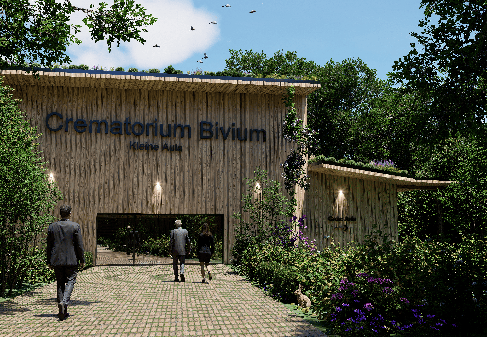
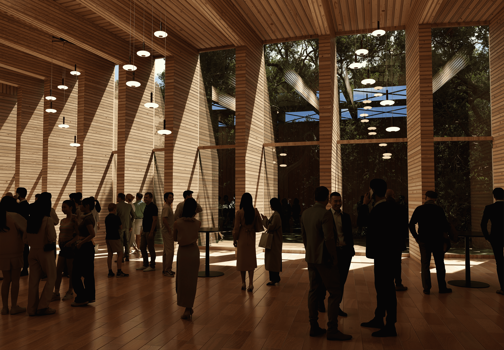
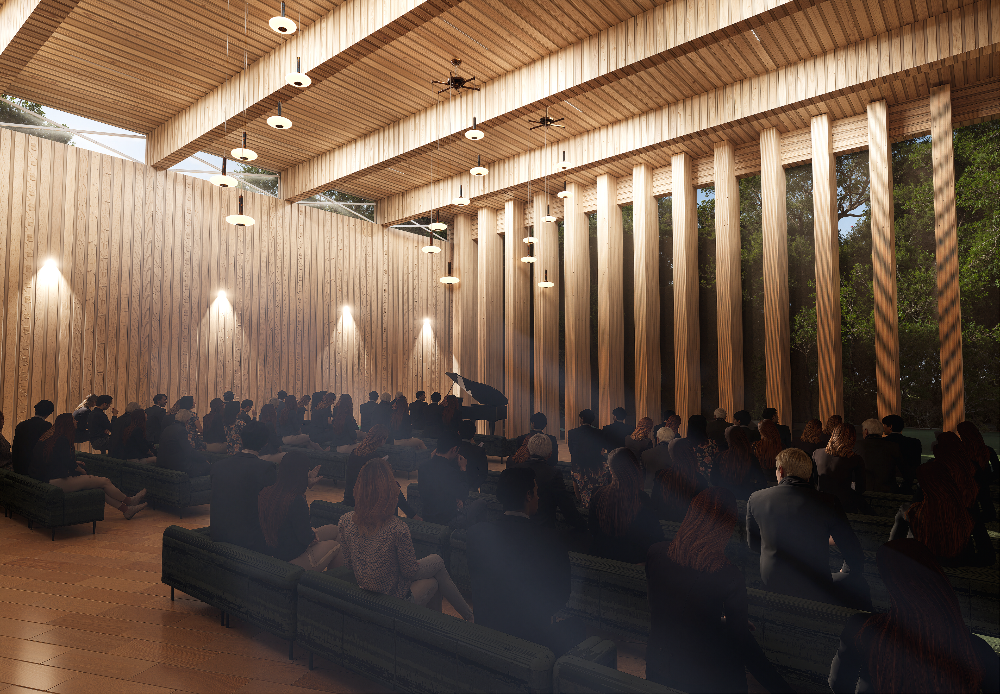
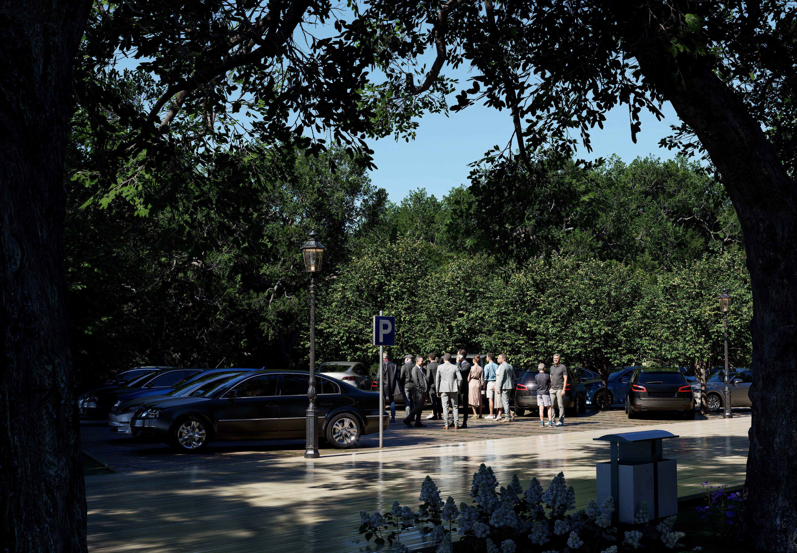
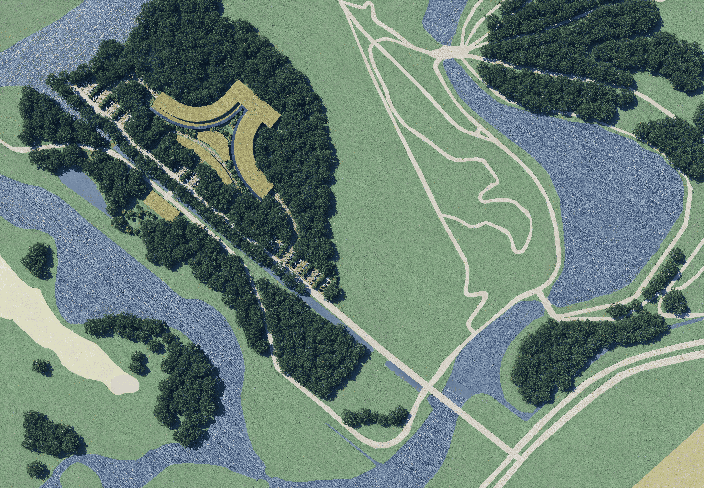
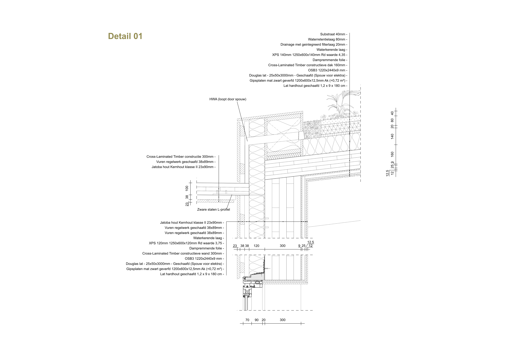
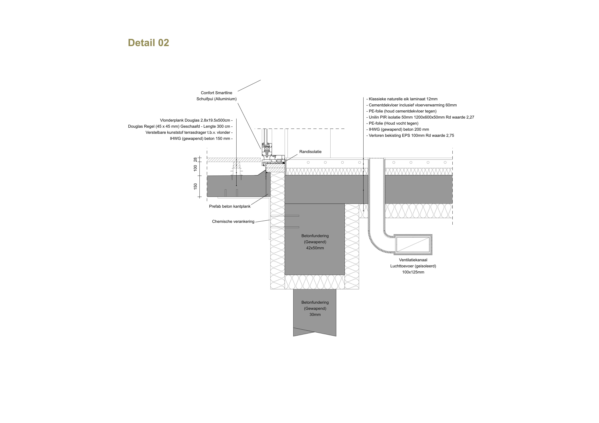
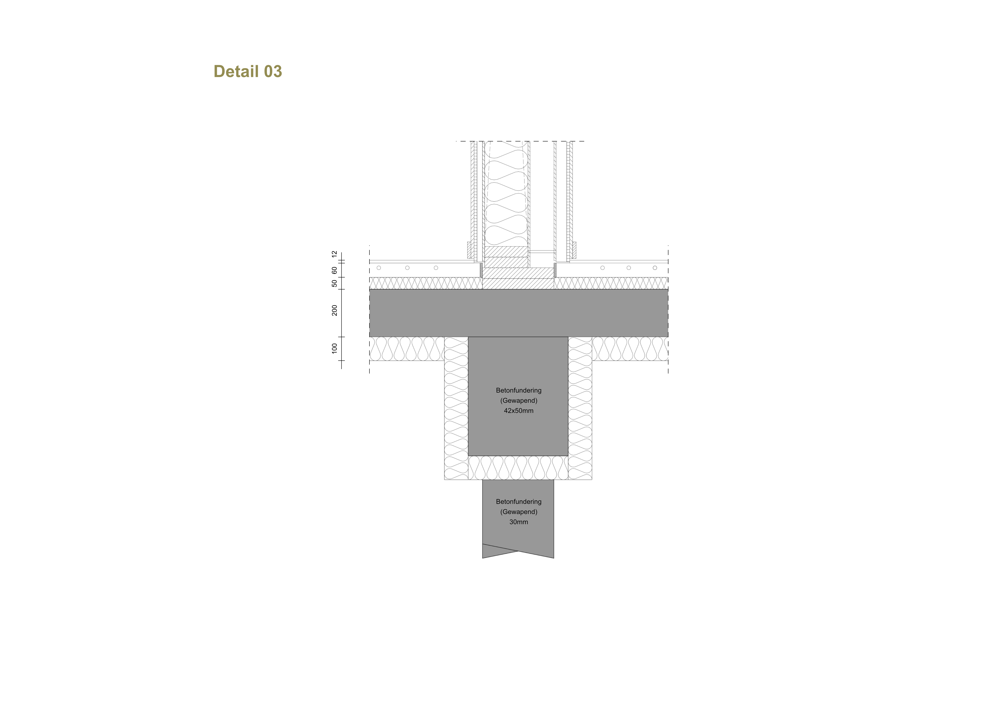
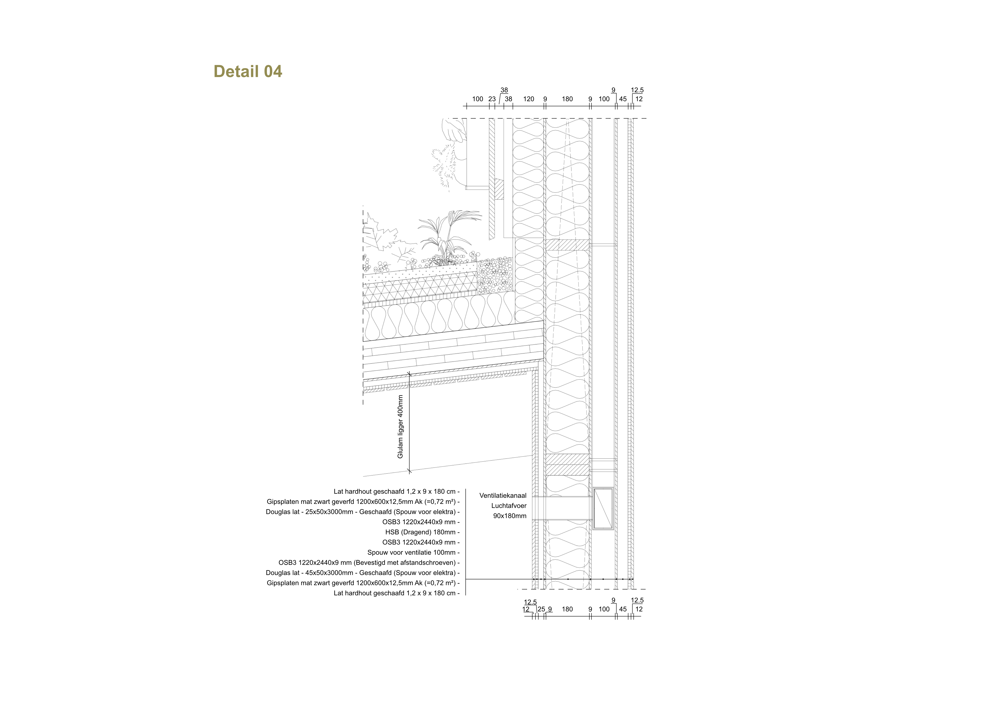
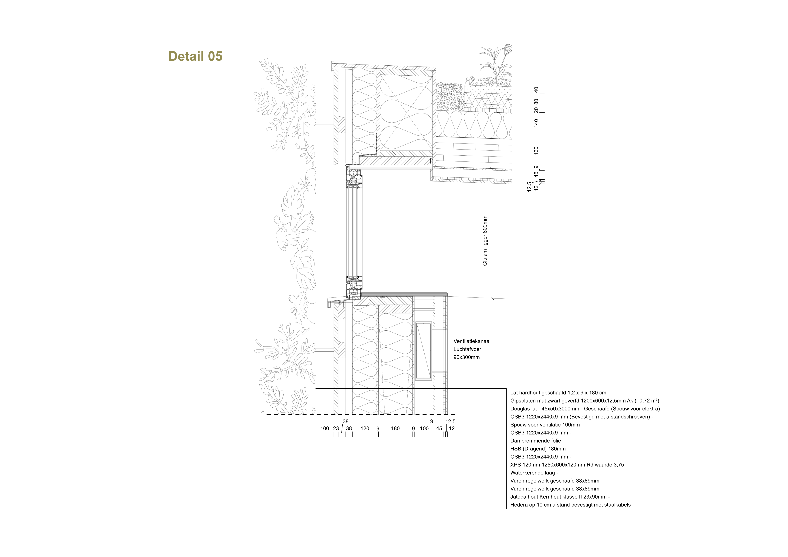

# Crematorium Bivium

For my graduation project, I designed Crematorium Bivium, a peaceful and respectful environment where architecture, nature and ritual come together. The design guides visitors through a gradual transition from public to intimate spaces, while separate routes provide privacy and tranquillity. Natural materials, integrated technical functions and sustainable solutions contribute to a calm and meaningful experience.

Grade: 8.5

  

  

    
    
    
    
    
    
    
    
    
    
    
    
    
    
  

 

  <button class="lightbox-nav prev" aria-label="Vorige afbeelding">&#10094;</button>
  
  <button class="lightbox-nav next" aria-label="Volgende afbeelding">&#10095;</button>

